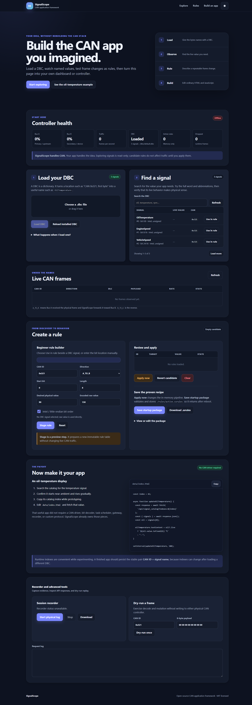

# SignalScope

SignalScope is an ESP32-S3 framework for turning CAN-bus discoveries into small, purpose-built applications.

At the simplest level, the workflow is:

1. Load a DBC so raw frame bits have useful names and units.
2. Watch those signals change on a real or simulated network.
3. Describe a frame change as a rule, test it, and save it as a package.
4. Replace or extend the included HTML interface with the app you actually wanted to build.

You do not have to rewrite CAN forwarding, DBC decoding, frame caching, rule scheduling, logging, replay, or the device web server for every idea. SignalScope supplies those pieces. Your application supplies the behavior, configuration, and user experience.

An oil-temperature display can be a few lines of browser JavaScript. A tuning interface can publish runtime values into dynamic rules. A controller can add its own state machine through the application-extension API. They all use the same transport and mutation engine.

The complete local interface keeps DBC loading, live-signal discovery, transactional rule building, recording, replay, and the handoff into your own application in one place:



## Who it is for

SignalScope is intentionally useful at two different depths:

- If you are new to CAN, the web interface gives you a visible path from “this value changes when I press the pedal” to a named signal and a reusable rule.
- If you already build embedded systems, the core provides a bounded, two-bus gateway, transactional rule tables, signal subscriptions, logging, replay, diagnostics transport, and a native C++ extension boundary.

You can start in the browser and only move into C++ when your application truly needs its own real-time logic.

## What SignalScope is—and is not

SignalScope owns the reusable infrastructure:

- bidirectional CAN forwarding between Bus A and Bus B;
- raw and decoded frame observation;
- DBC parsing and signal catalogs;
- staged, atomic mutation-rule changes;
- persistent `.ssrules` packages;
- session recording and dry-run replay;
- HTTP APIs and static-file hosting;
- optional application services for runtime values, diagnostics, and power policy.

An application owns the meaning:

- which DBC and signals are appropriate for its hardware;
- which rules are valid for its feature;
- its modes, maps, limits, and configuration;
- its UI, terminology, and user workflow;
- any validation required before it acts.

SignalScope does not ship vehicle-specific control logic or a universal CAN database. A DBC describes a particular network; it is evidence to verify, not permission to transmit. The bundled `data/dbc/default.dbc` is a synthetic learning example, not a vehicle definition.

OpenHaldex is one showcase of what can be built on this framework. It is not part of the standalone SignalScope core, rule packages, or web interface.

## Quick start

The included PlatformIO environment currently targets the ESP32-S3 N16R8/T-2CAN-style hardware configuration used by this project. Pin assignments and both 500 kbit/s CAN interfaces are defined near the top of `main.cpp`. Confirm those assignments before adapting another board.

Requirements:

- Visual Studio Code with PlatformIO, or PlatformIO Core on the command line;
- a data-capable USB cable;
- the supported ESP32-S3 board and two CAN transceivers/interfaces;
- a controlled bench network or other network you are authorized to test.

Build and upload the firmware:

```powershell
pio run -e lilygo-t2can
pio run -e lilygo-t2can -t upload
```

Upload the LittleFS web interface, starter DBC, and example rule package:

```powershell
pio run -e lilygo-t2can -t uploadfs
```

Optional serial monitor:

```powershell
pio device monitor -b 115200
```

To explore the complete interface before connecting hardware, run the local
in-memory preview instead. It serves realistic API responses but cannot write
to a physical CAN bus:

```powershell
python tools/preview_ui.py
```

Open `http://127.0.0.1:8765/`, then click through the same workflow you will
use on the device.

After boot, join the device access point:

```text
SSID: SignalScope-AP
Password: signalscope
Address: http://192.168.4.1/
```

Then follow the four cards in the interface: **Load DBC → Explore → Build rule → Apply/save**.

For a first connection and troubleshooting checklist, continue with [Getting started](docs/GETTING_STARTED.md). For a complete beginner project, use [Build an oil-temperature app](docs/FIRST_APP.md).

## The rule lifecycle in one minute

SignalScope separates trying a change from making it a startup configuration:

```text
author fields
    ↓
stage rule              no effect on forwarded frames
    ↓
apply commit            active now, in RAM
    ↓
save active.ssrules     validated, active now, and loaded next boot
```

`Apply` is deliberately not called `Save`: an applied rule is lost on reboot unless you write a valid package to `/rules/active.ssrules` (or provide `/rules/default.ssrules`). Uploading a package through the API validates every row before the firmware promotes it.

See [Rules and packages](docs/RULES.md) for exact formats and [HTTP API](docs/API.md) for programmatic access.

## Make it your app

There are two supported ways to build on SignalScope:

1. **Browser application:** edit the dependency-free files in `data/`. Fetch decoded values from `/api/signal_catalog` or `/api/signal_cache`, then present them however your app needs.
2. **Native application extension:** provide a strong `registerSignalScopeApplication(...)` definition and register callbacks. The extension can subscribe to signals, publish runtime values/tables, submit diagnostic jobs, annotate logs, and expose app-specific status/config/resources through generic host routes.

The browser path is ideal for dashboards and simple tools. The extension path is for application state that must remain on-device, run without a connected phone, or feed the rule engine predictably.

Start with [Application extension](docs/APPLICATION_EXTENSION.md) and the commented examples in `examples/`.

## Practical test discipline

SignalScope provides powerful transmit and mutation functions without imposing vehicle-generation gates or pretending to know your project. Use that freedom deliberately:

- establish a passive baseline before applying a rule;
- verify the DBC value against something physically observable;
- use replay with `dry_run=1` first;
- test one change at a time on a bench or stationary system;
- keep a known-good package and a direct way to remove device power;
- do not edit maps or rules while driving;
- use only on networks and vehicles you own or have permission to test.

This is development equipment, not a certified safety controller or a substitute for engineering judgment.

## Documentation map

- [Getting started](docs/GETTING_STARTED.md) — build, flash, connect, and verify the device.
- [Core concepts](docs/CONCEPTS.md) — frames, DBCs, signals, directions, observation, and rules.
- [First app](docs/FIRST_APP.md) — a complete oil-temperature walkthrough.
- [Rules and packages](docs/RULES.md) — lifecycle and `.ssrules` syntax.
- [Application extension](docs/APPLICATION_EXTENSION.md) — native app boundary and services.
- [HTTP API](docs/API.md) — routes, parameters, and examples.
- [Architecture](ARCH.md) — runtime ownership, data flow, and invariants.
- [Changelog](CHANGELOG.md) — project-level changes.
- [Third-party notices](THIRD_PARTY_NOTICES.md) — build dependencies and asset policy.

## License

SignalScope source, documentation, and the bundled standalone web interface are licensed under the [MIT License](LICENSE). Third-party dependencies remain under their respective licenses.
